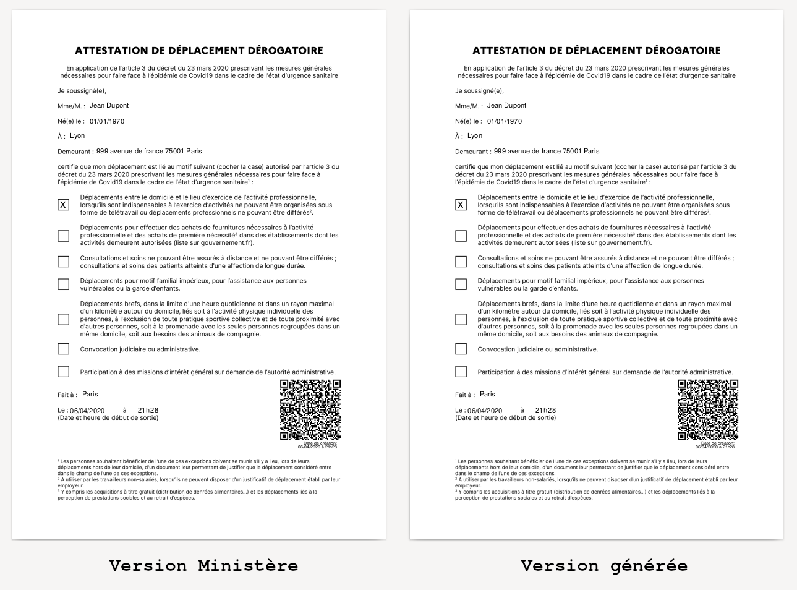

# Générateur d'attestation de déplacement dérogatoire COVID19

[Exemple d'attestation générée](exemples/attestation_exemple.pdf)

## Comment générer ?

Depuis votre console, à la racine du projet, tapez la commande ``make``.

Si vous n'avez pas de fichier de configuration, un assistant vous demandera de saisir les valeurs du formulaire (``make config`` permet de l'executer à la demande)

L'attestation généré se trouve à la racine du projet sous le nom ``attestation.pdf``

**Attention :** La génération est basée sur Makefile qui utilise l'heure de votre système pour savoir ce qu'il doit être fait. Si vous souhaitez générer plusieurs attestations par minutes, veillez à *cleaner* avant de relancer une génération sinon l'attestation contiendra les données de la première exécution de la minute considérée :

    make clean ; make

## Quelles dépendances ?

    apt-get install inkscape gettext-base python-qrcode pdftk make

## Peut-on utiliser un autre fichier de configuration que ``config/config.inc`` ?

Oui, le fichier de configuration est défini par la variable Makefile ``config_file``. Vous pouvez la surcharger (par ``config_courses.inc``dans cet exemple) ainsi :

    config_file=config/config_courses.inc make -e

Si le fichier n'existe pas, il sera créé via le générateur comme pour le fichier classique.

## Comment ca fonctionne ?

Le fichier Makefile vient remplir une version SVG de l'attestation du ministère de l'intérieur et un qr code contenant les informations attendues est généré.

## Y a-t-il des test ?

Oui :)

Il faut installer les dépendances suivantes afin de decoder le qrcode et comparer les deux pdf :

    apt-get install imagemagick perceptualdiff zbar-tools diffutils

Puis, vous pouver lancer les tests :

    make test

Si les qrcodes générés retournent le même résultat que ceux du PDF original et que le document généré a peu de différences visuelles avec l'original (moins de 1200 pixels de différences par page), les tests seront jugés concluants.
